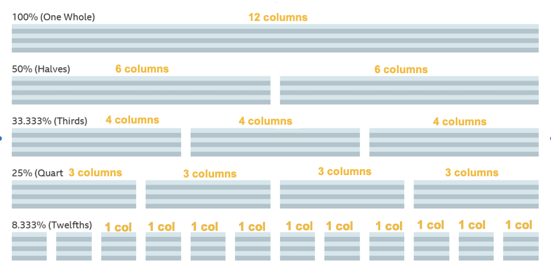

# simple-grid

- Always wrap your entire page with a `container` (unless you have a background image that you want to bleed to the edges of the page at all times)
- Wrap each set of elements in a `row`
- Don't change the width, padding-left, padding-right, margin-left or margin-right of the items that have a `[size]-col-[x]` class on them. 

### Reminder

A 12-column system works like this:



### Example usage:

```      
  <main class="container">
      <section class="block-of-items row">

        <div class="item-wrapper col-12 md-col-6 lg-col-3">
          <div class="item">
            <!-- content goes here -->
          </div>
        </div>

        <div class="item-wrapper col-12 md-col-6 lg-col-3">
          <div class="item">
            <!-- content goes here -->
          </div>
        </div>

        <div class="item-wrapper col-12 md-col-6 lg-col-3">
          <div class="item">
            <!-- content goes here -->
          </div>
        </div>

        <div class="item-wrapper col-12 md-col-6 lg-col-3">
          <div class="item">
            <!-- content goes here -->
          </div>
        </div>

      </section>
    </main>
```
